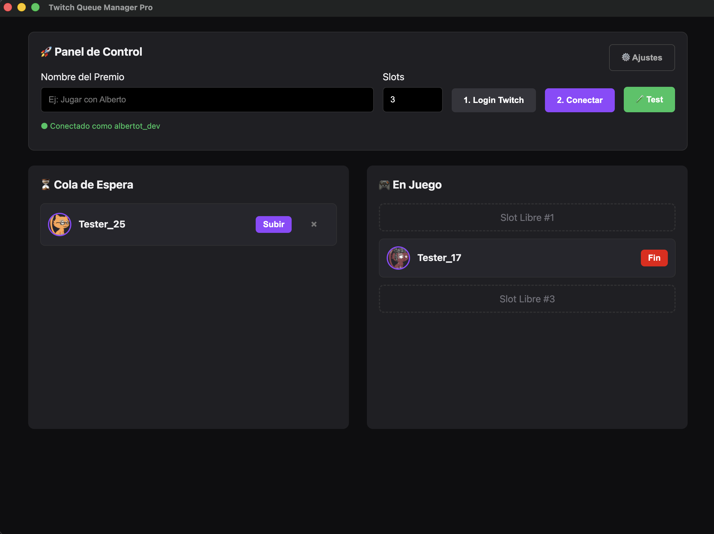
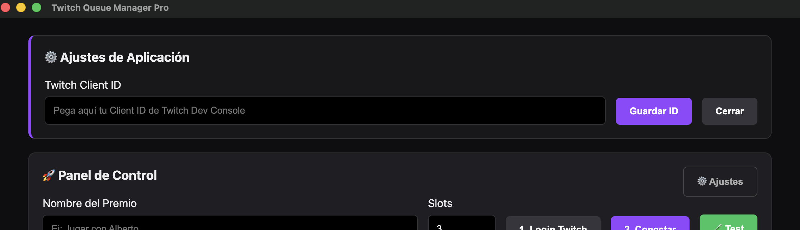
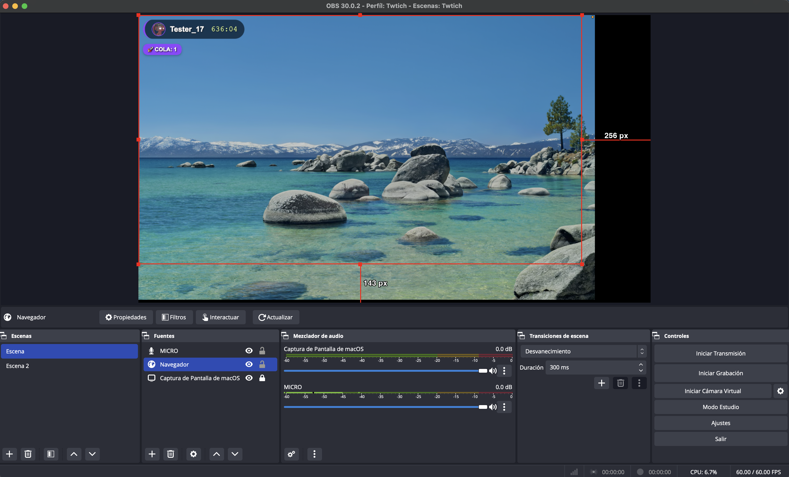

# 💜 Twitch Queue Manager (Twurple v8)

Una herramienta ligera y potente para que los streamers gestionen colas de jugadores utilizando **Puntos de Canal**. Integración directa con Twitch mediante WebSockets para una respuesta instantánea y configuración dinámica de credenciales.

## 📸 Screenshots

|             Panel de Control             |             Ajustes de ID              |
| :--------------------------------------: | :------------------------------------: |
|         |  |
| _Gestión de slots y cola en tiempo real_ |      _Configuración de Client ID_      |

|                       Overlay.                       |
| :--------------------------------------------------: |
|                   |
| _Dentro de OBS vista de slots y cola en tiempo real_ |

---

## ✨ Características

- 📡 **EventSub Real-time**: Captura canjes al segundo sin retraso mediante WebSockets.
- 🕒 **Persistencia**: Guarda tus configuraciones (Slots, Client ID) automáticamente.
- 🎬 **Overlay para OBS**: Diseño elegante incluido (`overlay.html`) para mostrar a tus espectadores.
- ⚙️ **Configuración Dinámica**: No necesitas editar el código para cambiar de cuenta o aplicación.

---

## 🚀 Formas de uso

### Opción A: Para Streamers (Uso rápido)

1. Ve a la sección de **Releases** en la parte derecha de este GitHub.
2. Descarga el instalador según tu sistema (`.exe` para Windows o `.dmg` para Mac).
3. Instala y abre la aplicación.
4. Pulsa en el icono de **⚙️ Ajustes** arriba a la derecha.
5. Pega tu **Client ID** (ver guía abajo) y dale a guardar.
6. ¡Ya puedes usar el botón de Login y conectar!

### Opción B: Para Desarrolladores (Modo local)

Si quieres modificar el código, sigue estos pasos en tu terminal:

1. **Clonar e instalar:**
   !!!bash
   git clone [https://github.com/albertot-dev/queue-twitch.git](https://github.com/albertot-dev/queue-twitch.git)
   cd queue-twitch
   npm install
   !!!

2. **Ejecutar:**
   !!!bash
   npm start
   !!!

---

## 🔑 Cómo obtener tu Client ID

Para que la aplicación pueda "hablar" con Twitch, necesitas registrarla en tu cuenta de desarrollador. Es gratis y se hace en 2 minutos:

1. Entra en el [Twitch Developer Console](https://dev.twitch.tv/console/apps).
2. Haz clic en **+ Register Your Application**.
3. Configura los siguientes campos:
   - **Name**: `Mi Cola de Jugadores` (o el nombre que quieras).
   - **OAuth Redirect URLs**: `http://localhost:3000/callback` (Cópialo exactamente igual).
   - **Category**: `Chat Bot` o `Other`.
4. Haz clic en **Create**.
5. En la lista de tus aplicaciones, dale a **Manage** y verás el campo **Client ID**. ¡Ese es el código que debes pegar en los ajustes de la App!

---

## 📺 Integración en OBS

1. Añade una **Fuente de Navegador** (Browser Source) en tu escena de OBS.
2. Selecciona **Archivo Local** y busca `overlay.html` en la carpeta del proyecto.
3. Ajusta el tamaño a **1920x1080**.
4. La lista se actualizará sola cada vez que muevas a un jugador a "En Juego".

---

Hecho con ❤️ para la comunidad de streamers por Alberto Tejero utilizando vibecoding.
